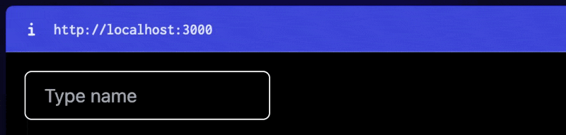

<!--
Get your module up and running quickly.

Find and replace all on all files (CMD+SHIFT+F):
- Name: My Module
- Package name: nuxt-queryref
- Description: My new Nuxt module
-->

# `queryRef()` - URL-persisted `ref()` for Nuxt

[![npm version][npm-version-src]][npm-version-href]
[![npm downloads][npm-downloads-src]][npm-downloads-href]
[![License][license-src]][license-href]
[![Nuxt][nuxt-src]][nuxt-href]



## Features

<!-- Highlight some of the features your module provide here -->

- Drop-in support instead of `ref()`
- Supports all common types (string, number, boolean, Arrays, Objects)
- Coherently typed for good DX

## Quick Setup

Install the module to your Nuxt application with one command:

```bash
npx nuxi module add nuxt-queryref
```

That's it! You can now use `queryRef` in your Nuxt app ✨

## Usage

Use `queryRef()` just like you would use a normal `ref()`

```ts
const variable = queryRef(<key>, <value>)
```

It takes two Parameters:

- `<key>`: The key for the URL Query Param
- `<value>`: The actual value, just like you would use with `ref()`

Following types are supported for `<value>`:

- `string`
- `number`
- `boolean`
- `Object`
- `Array (of each of the above)`

---

### Examples

```ts
const name = queryRef('name', 'Lukas')
```

```ts
// With generic type (optional, default is based on <value>)
const name = queryRef<string>('name', 'Lukas')
```

```ts
// With Object and custom type
const name = queryRef<{ firstName: string }>('name', { firstName: 'Lukas' })
```

## Use-cases

There are multiple scenarios where URL-persisting makes sense:

- In general: making URLs shareable or look the same on reload
- Persisting **_filters or sorting_** for sharing
- Persisting **_selected tabs or popups_**
- Persisting **_selected image (-index)_** for e.g. a slider

## Under the Hood

Some insights:

- The value is loaded on page load via **_useRoute()_**, which ensures that the value will already be loaded during **_SSR_** and no flickering will occur
- If the provided value is an **_array_**, the type will be **_inferred by the first item_** of the value. Therefore mixed-type arrays are currently not supported (or will lead to problems)

## Contribution

<details>
  <summary>Local development</summary>
  
  ```bash
  # Install dependencies
  npm install
  
  # Generate type stubs
  npm run dev:prepare
  
  # Develop with the playground
  npm run dev
  
  # Build the playground
  npm run dev:build
  
  # Run ESLint
  npm run lint
  
  # Run Vitest
  npm run test
  npm run test:watch
  
  # Release new version
  npm run release
  ```

</details>

<!-- Badges -->

[npm-version-src]: https://img.shields.io/npm/v/nuxt-queryref/latest.svg?style=flat&colorA=020420&colorB=00DC82
[npm-version-href]: https://npmjs.com/package/nuxt-queryref
[npm-downloads-src]: https://img.shields.io/npm/dm/nuxt-queryref.svg?style=flat&colorA=020420&colorB=00DC82
[npm-downloads-href]: https://npm.chart.dev/nuxt-queryref
[license-src]: https://img.shields.io/npm/l/nuxt-queryref.svg?style=flat&colorA=020420&colorB=00DC82
[license-href]: https://npmjs.com/package/nuxt-queryref
[nuxt-src]: https://img.shields.io/badge/Nuxt-020420?logo=nuxt.js
[nuxt-href]: https://nuxt.com
